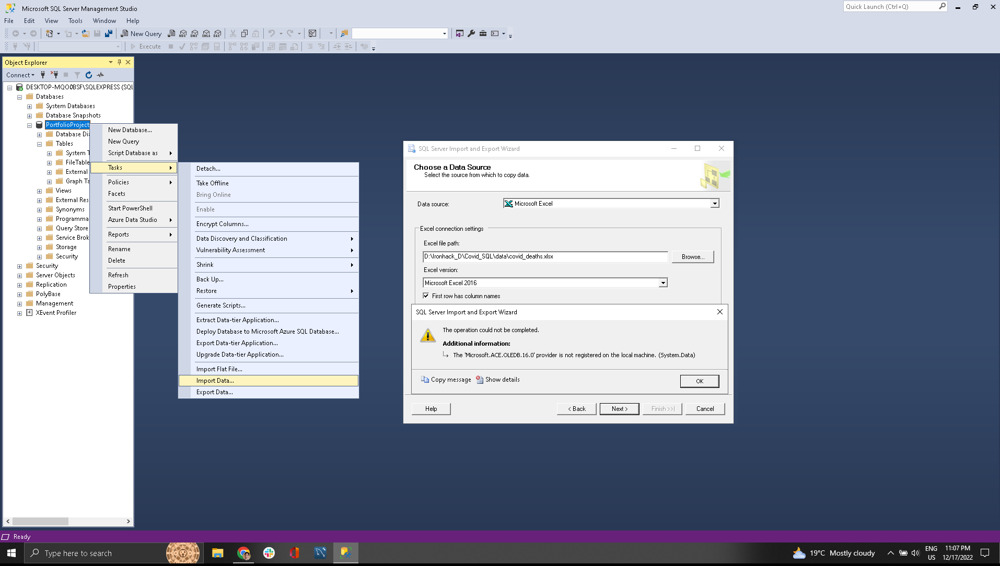
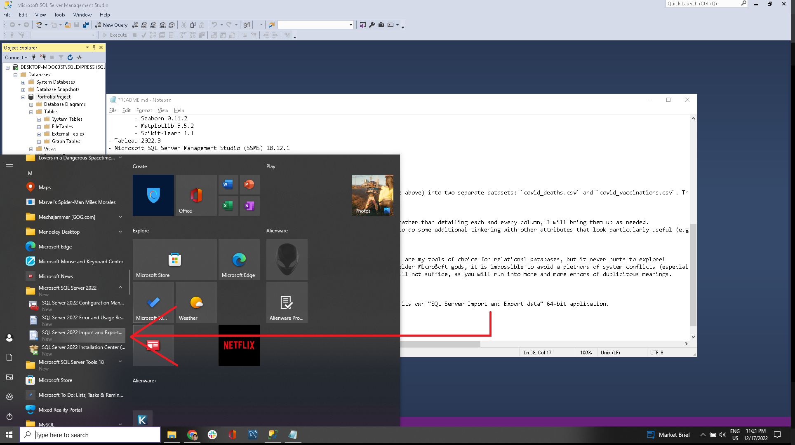
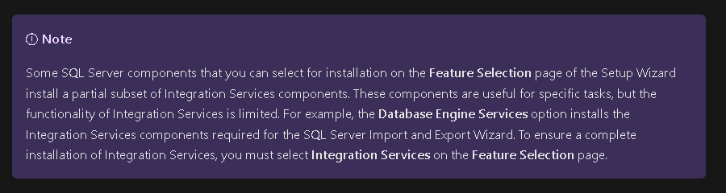
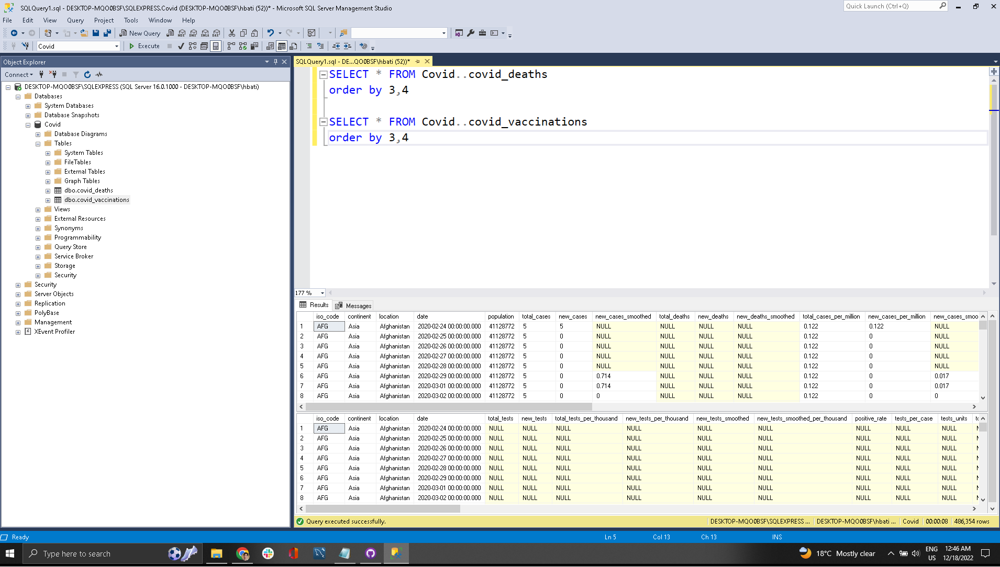

# Covid_SQL
 

# Project objective

***Exploratory Analysis of a Covid-19 Dataset using SQL***

I've done this project to showcase my skills related to:

- Joins
- CTE's
- Temporary Tables
- Windows Functions
- Aggregate Functions
- Creating Views
- Converting Data Types

Datasets can be found at : https://ourworldindata.org/covid-deaths (btw, super useful repository for projects in data science 🤘)

---

# Technologies

- Python 3.8.13
	- Pandas 1.4.4
	- Numpy 1.21.5
	- Pycaret 2.3.10
	- Seaborn 0.11.2
	- Matplotlib 3.5.2
	- Scikit-learn 1.1
- Tableau 2022.3
- Microsoft SQL Server Management Studio (SSMS) 18.12.1

---

## The files

I have artificially divided the original dataset with all the info (available on the site above) into two separate datasets: `covid_deaths.csv` and `covid_vaccinations.csv`. This was done in order to demonstrate the usefulness of SQL joins when data comes in broken pieces.

## The dataset

- Myriad info on Covid cases per country. The dataset has a total of *68* attributes so rather than detailing each and every column, I will bring them up as needed.
- An initial exploration will be focused on the *population* attribute. Later, I expect to do some additional tinkering with other attributes that look particularly useful (e.g. is the patient a smoker? Do they have comorbidities?).

## SSMS

- This was a good opportunity to try out a new tool, Microsoft SSMS. MySQL and PostgreSQL are my tools of choice for relational databases, but it never hurts to explore!
- That being said, with the back-end being coded in the ancient eldritch tongues of the elder Microsoft gods, it is impossible to avoid a plethora of system conflicts (especially related to 32/64bit issues).
	- Say you want to import that `covid_deaths.csv` file into SSMS. Its own tools will not suffice, as you will run into more and more errors of duplicitous meaning. 

- Thankfully, SSMS's sister program, _Microsoft SQL Server_, comes packaged with its own "SQL Server Import and Export data" 64-bit application.

- ... Which will also fail unless you have previously installed the Microsoft Integration Services.
	- You hadn't? Well uninstall Microsoft Server entirely and follow the custom instructions included [in this cryptic page from Microsoft itself](https://learn.microsoft.com/en-us/sql/integration-services/install-windows/install-integration-services?view=sql-server-ver16).
	- You might as well go prepare a cup of coffee and check your blood pressure in the meantime because this unninstaller will take its sweet time.
	- Now you are ready to perform a custom install. Mind the warnings that your Microsoft Firewall will probably block some of the ports necessary to run this whole operation.
	- After the inevitable failure of the first installation, you might be tempted to go down the internet rabbit hole that is the dreamlike experience of properly installing this godforsaken SQL package.
		- Instead, mind the footnote hanging at the __very end__ of the troubleshoot page, which tells you that this whole operation _will not work_ unless you *also* install the optional shared feature of Database Engine Services:

- While you reinstall everything, realize that Steve Jobs might have had a point after all, as only savants could possibly decypher these instructions from Microsoft on a first try.
- Eons will have passed, but time flows like a river and you will find yourself (hopefully, maybe) in possession of a semi-working version of Microsoft Server. I sure hope you have read the fine print of the terms and conditions where our Microsoft overlords ask nothing more from you than your undying loyalty, pity donations, and several liters of your blood to fuel their genesis device.
- Finally, fire up the import/export wizard and retrieve the .xlsx's. Will this be the last time we are confounded by this Microsoft treachery? I highly doubt it.

---

Anyway. With that out of the way, we are ready to run some queries. The syntax is, as usual, very similar to that used in other RMDBs.
- The feature to display more two or more outputs at the same time can be very convenient too:

- You can comment text from the editor with the command `ctrl-K --> ctrl-C`, which is absolutely bananas. Hard to forget though.

---

## Queries

-- Looking at Total Cases vs Total Deaths. What does the mortality look like?
SELECT Location, date, total_cases, total_deaths, (total_deaths/total_cases)*100 as 'death%'
FROM Covid..covid_deaths
order by 1,21:16 AM 12/18/2022

**insights**
- Most countries attain a Death% of ~2-4% after the infection is widespread.
	- Usually lower in 1st world countries.
	- Lethality is not a significative measure when gauging the impact that a pandemic will have on society as a whole.
	- Yet we are left to wonder the macabre outcomes that would result from a more lethal disease.

In Brazil, as of 12/16/2022, Brazil had close to 36 million registered cases. Close to 700.000 registered deaths. Roughly 10 Maracanã stadiums packed full. Most of these deaths avoidable after the development of a number of vaccines.
